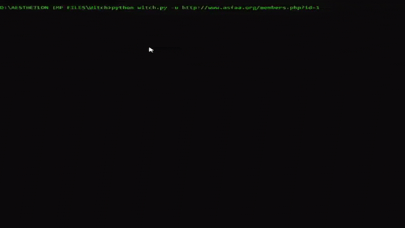

# TheWitchProject

Finds sqli vulnerabilities in websites using payload injection in URLs. Dorks google and performs multipage search, scrapes each result and scans every URL. Performs shallow to deep crawling in the site you provide to retreive subdomains and other URLs and scans them. Crawling option provided (depth)

<i>Video demonstrating Witch perform recursive crawling and vulnerability scanning on a target website.</i>